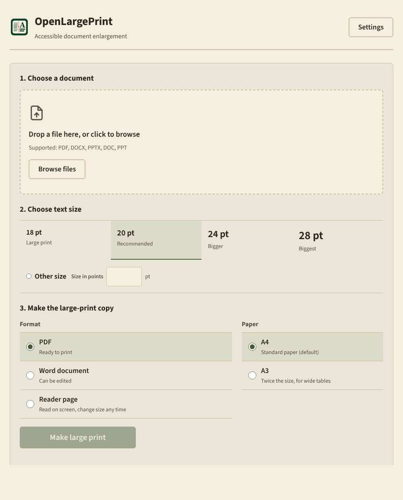

<p align="center">
  
</p>

<h1 align="center">OpenLargePrint</h1>

<p align="center">Turns PDFs, Word documents and slides into large-print books for people with low vision.<br>Everything happens on your own computer.</p>

<p align="center">
  <a href="https://github.com/ahmeddwalid/OpenLargePrint/releases/latest/download/OpenLargePrint-Setup-x64.exe"><strong>Download for Windows</strong></a>
  &nbsp;·&nbsp;
  <a href="https://github.com/ahmeddwalid/OpenLargePrint/releases/latest"><strong>Linux and other downloads</strong></a>
</p>



## What it does

Zooming into a two-column textbook or a scanned law book does not make it
readable: lines run off the screen, columns overlap, and you scroll sideways
all day. OpenLargePrint rebuilds the book instead. It reads the text, works out
the order to read it in, and sets it again in one column at the size you choose
(18 to 28 point, or any size you like), on A4 or A3 paper.

- **PDF, Word and Reader page.** A print-ready PDF, a Word document you can
  edit, or a page you read on screen and resize at any time.
- **Pictures, tables and exercises come along.** Pictures keep their original
  quality. Tables stay tables (wide ones are split or listed row by row). Answer
  lines in exercises stay as blanks to write on.
- **Scanned books work too.** Pages that are pictures of text are read with
  text recognition. Pages that already contain text are never recognised again,
  so their text stays exactly as published.
- **You can always check against the original.** Every part of the book is
  marked with its original page number. Words that were hard to read are marked,
  and the original lines are shown next to them.
- **Arabic and English.** Right-to-left text, mixed Arabic and English, and an
  Arabic interface.
- **Nothing leaves your computer.** Converting a document makes no internet
  connection at all.

## Download and install

| Your computer | Download |
| --- | --- |
| Windows 10 or 11 (64-bit) | [`OpenLargePrint-Setup-x64.exe`](https://github.com/ahmeddwalid/OpenLargePrint/releases/latest/download/OpenLargePrint-Setup-x64.exe) |
| Windows, without installing | `OpenLargePrint_<version>_windows_x64_portable.zip` from the [latest release](https://github.com/ahmeddwalid/OpenLargePrint/releases/latest) |
| Linux, any distribution (64-bit) | `OpenLargePrint_<version>_linux_x86_64.AppImage` |
| Fedora, openSUSE, RHEL | `OpenLargePrint_<version>_linux_x86_64.rpm` |
| Ubuntu, Debian, Mint | `OpenLargePrint_<version>_linux_amd64.deb` |

Nothing else needs to be installed: no Python, no extra downloads, and no
administrator rights on Windows. The text recognition and layout models are
included.

### Windows

Run `OpenLargePrint-Setup-x64.exe`. It installs for your user account only.

The Windows files are **not code-signed** yet, so Windows is careful with them:

- **"Windows protected your PC" (SmartScreen).** Click **More info**, then
  **Run anyway**. This only happens the first time.
- **Smart App Control** (Windows 11). If it is turned on, Windows blocks
  unsigned apps and offers no way past the block. OpenLargePrint cannot run on
  that computer until a signed version is published, or Smart App Control is
  turned off (Windows Security > App & browser control > Smart App Control;
  on many Windows 11 versions it can only be turned back on by resetting
  Windows, so decide carefully). [SIGNING.md](SIGNING.md) explains the signing plans.

The portable zip needs no installation: extract it anywhere and run
`OpenLargePrint.exe`. Keep the files together.

### Linux

AppImage: make it executable and run it.

```bash
chmod +x OpenLargePrint_*_linux_x86_64.AppImage
./OpenLargePrint_*_linux_x86_64.AppImage
```

Some distributions need `libfuse2` for AppImages (Ubuntu 22.04 and later:
`sudo apt install libfuse2`).

RPM or DEB: `sudo dnf install ./OpenLargePrint_*.rpm` or
`sudo apt install ./OpenLargePrint_*.deb`.

### Check your download

Each release has a `SHA256SUMS.txt`. On Linux:
`sha256sum -c SHA256SUMS.txt --ignore-missing`. On Windows (PowerShell):
`Get-FileHash .\OpenLargePrint-Setup-x64.exe` and compare with the line in the
file.

## Using it

1. Choose a document (PDF, DOCX, PPTX, or DOC/PPT if LibreOffice is installed).
2. Choose a text size. 20 point is a good start.
3. Choose PDF, Word or Reader page, and A4 or A3, then **Make large print**.

The copy is saved next to the original as `Name - large print.pdf`
(**Save somewhere else…** changes that). When it is done, the book opens in the
built-in reader, where you can change the size, spacing and colours, search,
and have it read aloud. Your last choices are remembered.

**More options** has: converting only some pages, starting each original page
on a new sheet, black-and-white pictures for laser printers, and a searchable
copy of the original PDF (same size, with text you can search and copy).

Print at **100% / actual size**, not "fit to page", or the printer shrinks the
text again.

### Updates

Updates are off until you turn them on (Settings > Updates). When on, the app
asks GitHub whether there is a newer version. On Windows it can download the
new installer, checks its SHA-256 checksum against the release, and only then
runs it. On Linux it opens the release page. Converting documents never uses
the internet, with or without updates turned on.

## What to expect

- A computer from the last few years is enough; no graphics card is needed.
  Pages with text take about a second each; scanned pages take a few seconds
  each.
- Recognition of scanned Latin-script text is well tested. Scanned **Arabic**
  is recognised with a bundled Arabic model, but its accuracy has not yet been
  measured on a large set of real Arabic books, so check Arabic scans against
  the original pages. Arabic text that is already in a PDF is read exactly.
- Hard-to-read words are marked rather than guessed, and nothing is ever
  "corrected" by rewriting it.
- macOS is not supported.

## Building from source

You need Python 3.12 with [uv](https://docs.astral.sh/uv/), Node.js 20, and
Rust (stable). On Windows also the Visual Studio C++ build tools; on Linux the
WebKitGTK 4.1 development packages.

```bash
git clone https://github.com/ahmeddwalid/OpenLargePrint.git
cd OpenLargePrint
uv sync --locked --dev --extra dev --python 3.12
uv run python scripts/fetch_models.py      # layout and Arabic models, checked by SHA-256
npm --prefix ui ci
```

Run the tests:

```bash
uv run pytest tests/ -q
uv run python -m openlargeprint.cli benchmark --fail-on-mismatch
npm --prefix ui test -- --run
cd src-tauri && cargo test
```

Convert from the command line:

```bash
uv run python -m openlargeprint.cli convert book.pdf -o "book - large print.pdf" --preset Large --paper-size A4
```

Build the apps:

- Windows: `powershell -ExecutionPolicy Bypass -File packaging/build_windows_app.ps1`
  (installer and portable zip in `packaging/dist/`). Set
  `OLP_CODESIGN_THUMBPRINT` to sign them.
- Linux (Ubuntu): install `libwebkit2gtk-4.1-dev librsvg2-dev patchelf rpm`, then

  ```bash
  uv run python packaging/build_sidecar.py
  npm --prefix ui run build
  cd src-tauri && npx -y @tauri-apps/cli@2.11.5 build --bundles appimage,rpm,deb
  ```

Releases are built by [`.github/workflows/release.yml`](.github/workflows/release.yml)
on Windows and Linux runners. Each package converts test documents with its own
packaged engine before anything is published.

## Documentation

- [SPEC.md](SPEC.md): what the product must do (requirement IDs).
- [DESIGN.md](DESIGN.md): how it is built.
- [AGENTS.md](AGENTS.md) and [CONTRIBUTING.md](CONTRIBUTING.md): how to change it.
- [CHANGELOG.md](CHANGELOG.md): what changed in each version.
- [SIGNING.md](SIGNING.md): Windows code signing.

## License

GPL-3.0-or-later. See [LICENSE](LICENSE). Bundled fonts (Atkinson Hyperlegible,
Noto Sans Arabic, Source Sans 3: SIL Open Font License; DejaVu Sans: Bitstream
Vera license) and models (PaddlePaddle PP-OCR and PP-DocLayout: Apache 2.0)
keep their own licenses; see [sbom.json](sbom.json).
