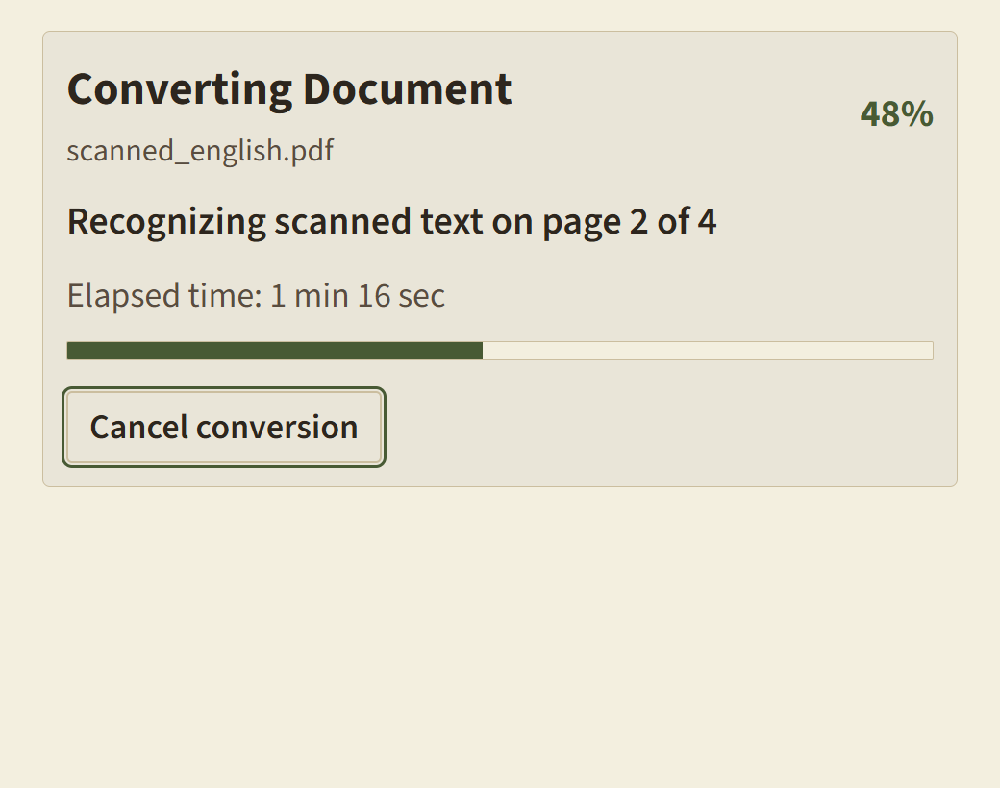

# Verification report: faithful conversion and Windows releases

Status: implementation changes prepared; release acceptance remains blocked.
Branch: codex/faithful-conversion-windows. Source version: 0.5.0.
SBOM records the pinned Arabic dictionary, optional RapidOCR runtime dependencies,
English-v6 weights and the disabled Arabic-v5 research candidate. Optional weights
were prepared locally and are excluded from the base frozen payload.

## Demonstrated GUI failure

The pre-existing desktop executable and adjacent engine are 0.1.0. No installed
registry entry was found; the existing release executable was used. The c1/c2
306-page input reached 306/306, then failed during final export. The retained
source-table image on source page 294 was 481.89 x 718.09pt, versus a frame of
469.89 x 716.50pt, on output page 1640. This demonstrates a final-export failure;
a second-page stall was not reproduced in that run. Elapsed time and engine peak
memory for this GUI run were not measured. Content-free telemetry is in
[gui-reproduction.json](gui-reproduction.json).

The new source uses frame-padding-aware image bounds, constrains both dimensions,
and has a real-output regression for a tall retained table at 20pt/28pt. The real
source page 294 exports at both sizes too. Its rendered output was inspected;
inferred-table and OCR fidelity still require review. A source-engine page test
is not a full-document rebuilt-GUI comparison.

## Implementation and requirement coverage

- PDF-001..006, DOC-001..003, OCR-004..007: source-character ownership, no default
  spelling/letter-spacing/hyphen/bullet/margin rewriting, column/section ordering,
  mixed-page reconciliation, blank-page anchors, exact OCR text preservation,
  failed/uncertain page imagery, optional evidence failures retain extracted text.
- IMG-001..003, TBL-001..002: decoded-content image matching, scanned figure crops,
  retained covers/artwork, consistent native/scanned table geometry, uncertainty
  warnings/source crops, shared merged-cell traversal and repeated PDF headers.
- FN-001..002, OUT-001..003/005..010: readable warnings, heading/caption association,
  frame-safe images, table row splitting, shared IR exports and re-export/selection.
- UI-002..005, PERF-002, SEC-007..009: elapsed progress heartbeats through export,
  terminal-event ordering, worker timeout/cancel/crash/restart regressions,
  content-free diagnostics, offline conversion checks.
- PKG-001..002, SEC-006: source/dependency sidecar fingerprints, real startup health
  and version checks, mandatory trusted public signing, native payload/NSIS
  uninstaller signing wiring, installed signature verification and exact-artifact
  enforced-SAC publication gate. Installed acceptance is open.

## Automated and visual evidence

Follow-up source verification enables the optional English pack for its real
offline test. The Python suite, UI suite/build and frozen-engine checks are
recorded in [test-results.md](test-results.md). Frozen optional recognition checks
actual health capabilities, exact native text, spawned second-page recognition,
PDF export and `ocr_maximum` provenance. Arabic-v5 is refused, not silently reordered.

Final command results are recorded in the accompanying handoff ledger. The full
Python suite includes malformed/security, schema, worker recovery, native and
scanned samples, actual PDF/DOCX/Reader output, A4/A3 and selected-page checks.
Three LibreOffice-dependent tests are skipped because LibreOffice is unavailable.
Frontend: 33 tests across seven files passed; TypeScript/Vite production build passed.
Rust formatting passes. Rust compilation/tests and installer creation are blocked
by Application Control, described below. PowerShell packaging scripts parse.

The frozen sidecar smoke test performs native + second-page OCR, actual A4/A3 PDF
and DOCX exports, selected-page exports, exact health/version, icons and UI assets.
No newly frozen binary is labelled as a signed public distribution.

Progress-screen QA used the actual React component in Edge through bundled
Playwright: keyboard focus and Enter cancellation, minimum 44px cancel target,
200% text scale, narrow viewport, high contrast, reduced motion, no horizontal
overflow and no page errors. The visual craft checklist was reviewed for the
changed progress screen; existing typography, restrained surfaces and controls
were preserved. Evidence:

[Normal](screenshots/progress-normal.png),
[high contrast](screenshots/progress-high-contrast.png),
[machine-readable UI checks](screenshots/progress-check.json).

The changed advanced option also passed keyboard selection, visible focus, minimum
48px target, 200% text, 640px width, high contrast, reduced motion and RTL layout.
Visual inspection caught and corrected a truncated selected label. The actual
React screen was rendered with a substituted capability handshake; this is
frontend evidence, not rebuilt native-GUI acceptance. Screenshots were checked
against the repository visual craft checklist:

[normal](screenshots/advanced-normal.png),
[200% text](screenshots/advanced-200-percent.png),
[narrow](screenshots/advanced-narrow.png),
[high contrast](screenshots/advanced-high-contrast.png),
[RTL](screenshots/advanced-rtl.png),
[checks](screenshots/advanced-check.json).

## Benchmark fidelity, speed and memory

[Per-case metrics](benchmark-results.md) list all 16 synthetic cases separately.
Execution PASS means completed conversion or safe rejection, not fidelity acceptance.
The updated corpus includes independent transcripts/order/cells/pixels and genuine
mixed, rotated, Arabic and figure content. Table transcripts count semantic cells
once and exclude Markdown formatting. Distinct embedded images retain exact pixels
and aspect ratios. Baseline Arabic/mixed-script recognition remains below release
quality. Reference scores and the older geometry heuristics are reported separately
in [benchmark-results.json](benchmark-results.json) and the Markdown table. Old and
new corpus metrics are not directly comparable. Missing metrics are N/A. Child RAM
and VRAM are unmeasured; parent RAM is a lifetime peak. Concurrent test load prevents
treating these timings as an isolated engine comparison.

The optional English comparison is in [accuracy-results.md](accuracy-results.md)
and [accuracy-results.json](accuracy-results.json). Table CER/WER improves from
0.049/0.500 to 0.012/0.167; the main English scan is unchanged, and the skewed
sample regresses. The pack therefore remains optional. Real Arabic-v5 decoder
testing emitted visual-order text; that candidate stays disabled pending proper
logical/mixed-direction acceptance. Details and licenses: [ACCURACY_PACK.md](../../ACCURACY_PACK.md).

## Full-book diagnostic run

The source-engine run started on an intermediate revision and is **not final
acceptance evidence**. All eight completed, with page-anchor fidelity 1.0 and
embedded A4/A3 paper dimensions checked. Outputs remain local and ignored by Git.

| Input | Source pages processed | Output pages 20pt / 28pt | Selected A3 output pages | Extraction + export seconds | Total including re-export seconds |
|---|---:|---:|---:|---:|---:|
| a1/a2 | 318/318 | 1117 / 1846 | 6 | 1272.94 | 1282.11 |
| b1/b2 | 394/394 | 2532 / 3880 | 6 | 232.22 | 338.02 |
| c1/c2 | 306/306 | 309 / 519 | 6 | 2236.03 | 2237.17 |
| Phrasal Verbs Advanced | 195/195 | 1075 / 1806 | 5 | 42.31 | 63.33 |
| Collocations Intermediate | 194/194 | 1233 / 1900 | 4 | 56.97 | 82.30 |
| Phrasal Verbs Intermediate | 210/210 | 1174 / 1801 | 8 | 551.81 | 693.27 |
| Vocabulary b2 | 280/280 | 1733 / 2712 | 12 | 432.91 | 470.67 |
| Vocabulary c1/c2 | 303/303 | 1748 / 2829 | 5 | 119.47 | 178.84 |

Parent lifetime peak was 310.5MB for the first book and 807.7MB subsequently.
Child RAM/VRAM and book-level CER/WER/order/table/image ground truth are unmeasured.
Large output-page counts and flagged blocks require layout review; completion is
not proof of fidelity. Final-revision all-eight GUI conversions, representative
full-book visual acceptance, and physical 100%-scale printing remain open.
Source documents were left unchanged.

## Windows release blockers

The corrected development installer configuration reaches Rust compilation, where
Windows Application Control blocks build-script executables and procedural-macro
DLLs (OS error 4551). Code Integrity events identify the blocked compiler artifacts.
Examples include rfd's build-script-build and zerovec_derive DLL. Fresh Rust tests
are blocked too. No security policy was changed. The complete VS2019 BuildTools
installation works; an incomplete VS2022 installation is skipped.

No trusted signing identity is available. Consequently no rebuilt installer,
installed uninstall.exe verification, enforced-SAC launch/OCR/update/removal, or
full rebuilt-GUI corpus acceptance is delivered. The release workflow fails closed
until exact signed-artifact acceptance is supplied in a protected environment.
See [SIGNING.md](../../SIGNING.md) for provisioning, installed checks and the
acceptance manifest contract. A suitable build host and trusted signing access
are prerequisites, followed by the full enforced-mode acceptance run.

No principle-level conflict was resolved by relaxing preservation or security.
OCR uncertainty and missing acceptance remain explicit limitations.
